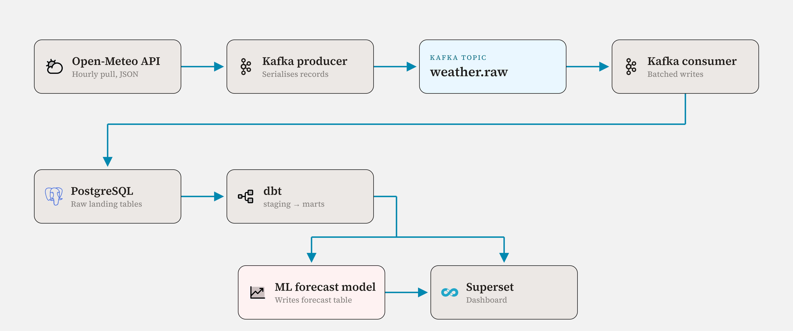

# Real-Time Weather Pipeline — Kafka · Postgres · dbt · Airflow · Superset · ML

> **Status: Phase 0 — scaffolding.** Nothing is built yet. This README grows as
> the project grows; each phase in the guide ends by updating it.

A streaming data platform that ingests live weather observations, lands them in
a warehouse, models them with dbt, orchestrates everything with Airflow,
visualizes them in Superset, and forecasts the next 24 hours of temperature with
a time-series model.

## Target architecture

  

## Build log

Tick these off as you go. Every phase is one branch and one merge commit.

- [x] Phase 0 — Foundations: repo, tooling, environment
- [ ] Phase 1 — Warehouse: PostgreSQL in Docker
- [ ] Phase 2 — Source: Open-Meteo ingestion script
- [ ] Phase 3 — Streaming: Kafka producer and topic
- [ ] Phase 4 — Sink: Kafka consumer into Postgres
- [ ] Phase 5 — Transform: dbt staging and marts
- [ ] Phase 6 — Orchestrate: Airflow DAGs
- [ ] Phase 7 — Visualize: Superset dashboard
- [ ] Phase 8 — Forecast: time-series model
- [ ] Phase 9 — Harden: tests, CI, observability
- [ ] Phase 10 — Ship: docs and portfolio polish

## Quick start

_Not available yet — you will write this in Phase 1 and keep it accurate as you
go. If a reader cannot go from `git clone` to a running dashboard using only
this section, the project is not finished._

## The guide

The full step-by-step build guide lives in [`docs/`](docs/) as a PDF. Work
through it in order; do not skip ahead.

## Stack

| Layer          | Technology            |
| -------------- | --------------------- |
| Source         | Open-Meteo API (no key required) |
| Transport      | Apache Kafka          |
| Storage        | PostgreSQL            |
| Transformation | dbt                   |
| Orchestration  | Apache Airflow        |
| Visualization  | Apache Superset       |
| Forecasting    | _decided in Phase 8_  |
| Runtime        | Docker Compose        |

## License

MIT — add the `LICENSE` file in Phase 10.
